# Duplicar Projeto GIT
**Através do GIT BASH**

* 1 - Abra o Gitbash
* 2 - Vamos utilizar o comando **bare**, que copia as ramificações do projeto. Para clonar o projeto utilize o comando **git clone --bare "URL do repositôrio"**
* 3 - Apôs termos clonado o projeto, iremos para o caminho que se encontra o projeto utlizando **cd nome_projeto.git**
* 4 - Uma vez que estamos dentro do projeto, podemos espelha-lo para outro repositôrio utlizando o comando **git push --mirror "URL do novo repositôrio"**
* 5 - Sem necessidade de existir o velho repositôrio, podemos remove-lo. Utilizando o comando **cd..** iremos voltar para a pasta root, agora com o comando **rm -rf "Velho-repositôrio.git"** iremos remover o projeto.

**EXEMPLO**

```
Projeto: https://github.com/vcmoraes/themovies

//CLONANDO O REPOSITÔRIO
git clone --bare https://github.com/vcmoraes/themovies

//ESPELHANDO O PROJETO PARA O NOVO REPOSITÔRIO
cd the-movie.git
git push --mirror https://github.com/novocaminhogit/new-the-movie.git

//REMOVENTO O REPOSITÔRIO ANTIGO
cd ..
rm -rf the-movie.git
```

# Importar Projeto GIT
**AtravÈs do GIT BASH**

* 1 - Abra o Gitbash
* 2 - Selecione o caminho que você deseja importar o projeto através de cd Caminho... 
	Exemplo: **cd c**: ENTER
		 **cd Users/Public/Documents** (Caso aperte o TAB, o comando ter· um auto complete para o diretôrio)
		 Nota: Para ver os diretôrios presentes em que o usuário se encontra digite a palavra dir e aperte ENTER
* 3 - Apôs selecionado e especificado o caminho copie a URL do diretôrio onde o projeto GIT está.
* 4 - Para importar o projeto use o comando **git clone** "URL do diretôrio"
* 5 - Caso você tenha permiss„o para acessar o repositôrio, o projeto será copiado para o caminho especificado, caso não tenha, irá abrir uma sessão de login para entrar com os dados de usuário.

**EXEMPLO**

```
Projeto: https://github.com/vcmoraes/themovies

//Navegar até o caminho da pasta
cd Users/Public/Documents
git clone https://github.com/vcmoraes/themovies
```

# Importar Projeto

* 1 - Baixe e instale a verão mais recente do Android Studio: [ANDROID STUDIO](https://developer.android.com/studio/index.html?hl=pt-br)
* 2 - Inicie o Android Studio e em seguida selecione a opção **"Open an existing Android Studio project"**

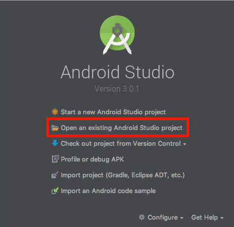

* 3 - Navegue até a pasta no qual foi feito a importaÁ„o e selecione a pasta **"template-android"** e então realize a importação

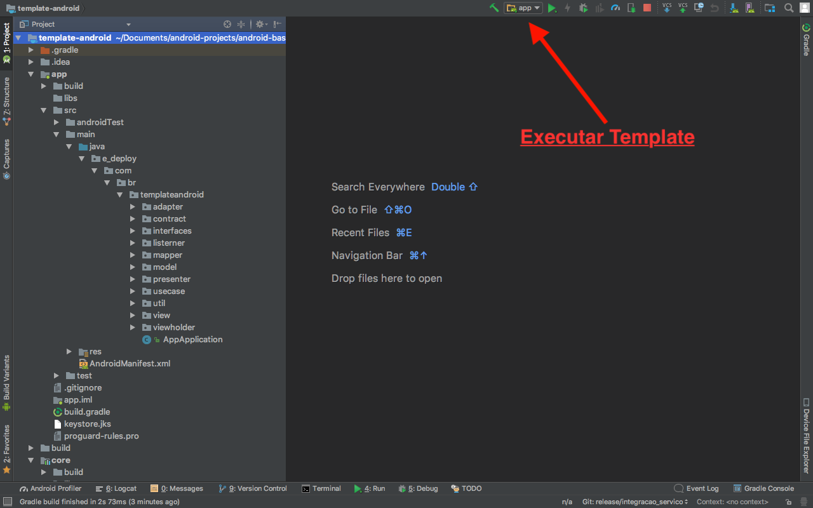

# Entendendo o Projeto

Libs Utilizadas para apoio:

* 1 - Android Annotatios - Para injeção de dependências
* 2 - EvenBus - Para notifição de Eventos
* 3 - Retrofit - Para chamadas de API
* 4 - Picasso - Carregamento de imagens 
* 5 - Realm - Para persistência de dados(Contudo ainda não utilizado no projeto)

Esse projeto utiliza o conceito MVP (Model View Presenter) com **UseCases**, ou seja, temos a camada da **View** que se comunica com o **Presenter** no qual se comunica com os **UseCases** e os mesmo se comunicam com os Serviços(**core**).

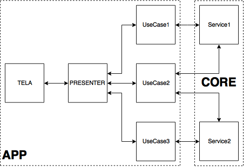

**APP**

* Tela - **View** responsável por mostrar informaçõess ao usuário, como **Activity, Fragment, Dialog e etc**. 

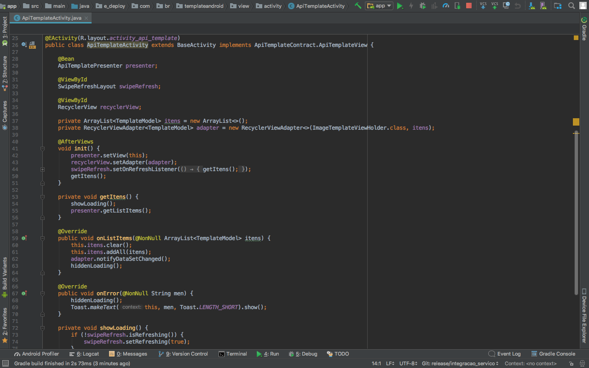

* Contract - **Interface** responsável por garantir o **contrato entre o Presenter e a View**.

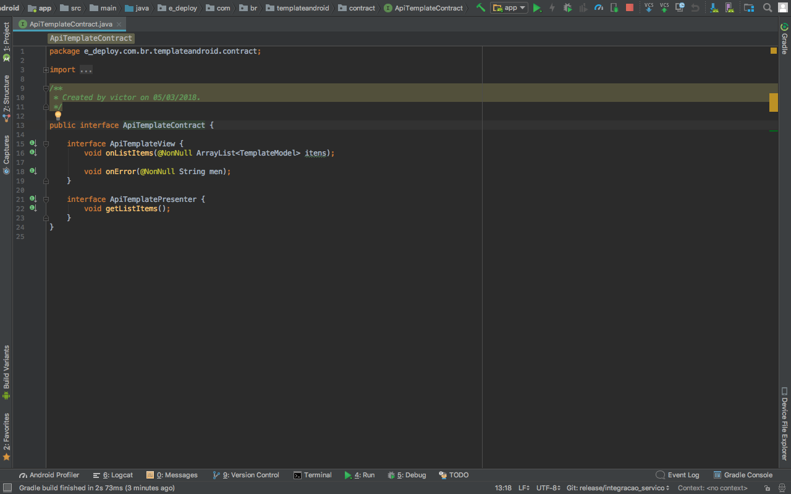

* Presenter - responsável por fazer a comunicação entre a **View** e os **UseCase**, **(NO PRESENTER N√O VAI REGRA DE NEGÓCIO, POIS SE NÃO O USECASE FICA SEM EMPREGO)**

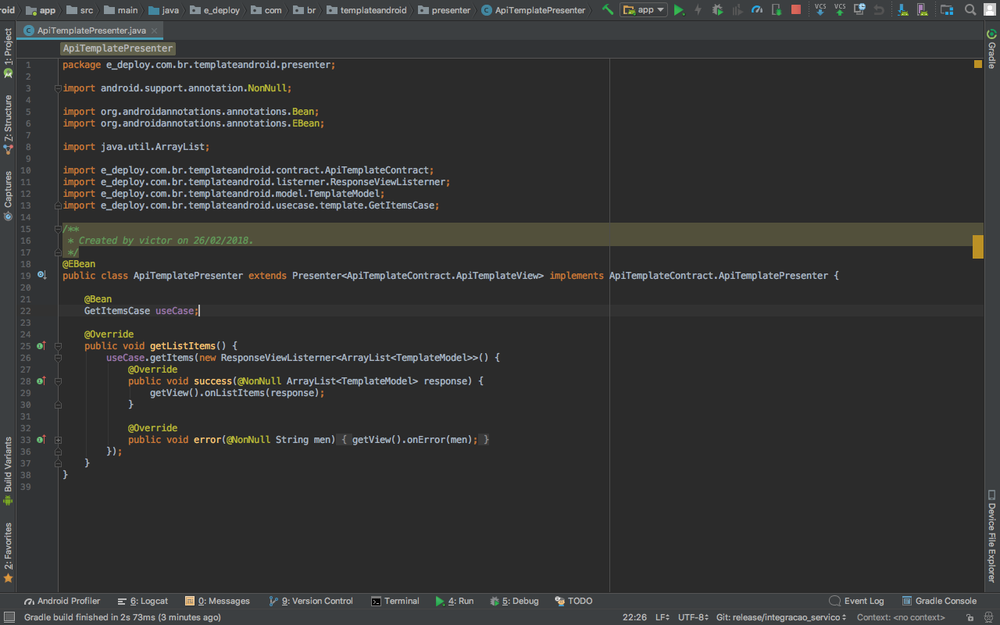

* UseCase - responsável por fazer a comunicação entre **Presenter** e o Serviço(**core**), sendo aqui onde fica as regras de negôcios e conversão dos objetos entre **App e Core** utilizando os **Mapper**, **(NADA DE FAZER CONVERSÃO FORA DOS MAPPERS, POIS ELES PRECISAM DESSE EMPREGO)**

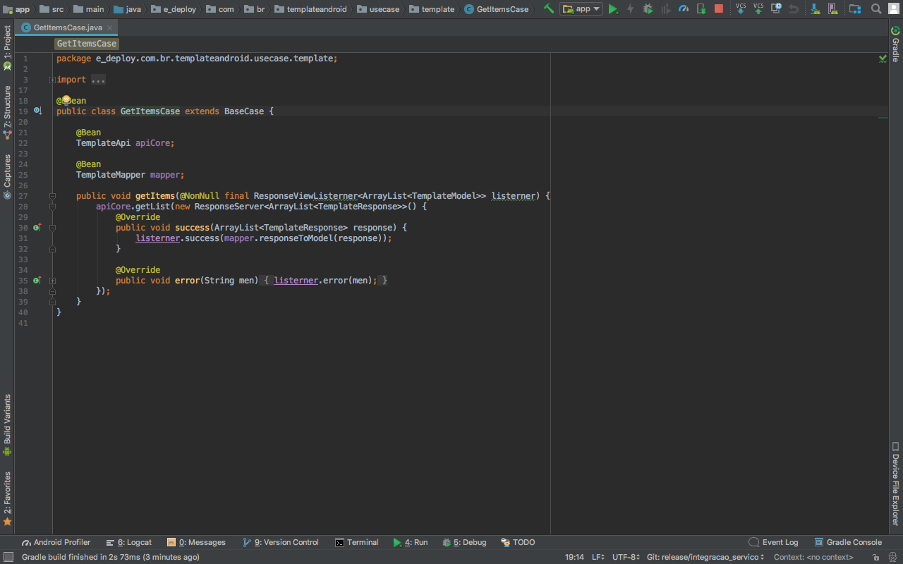

* Model - responsável por representar os dados de um Objeto para as **View**

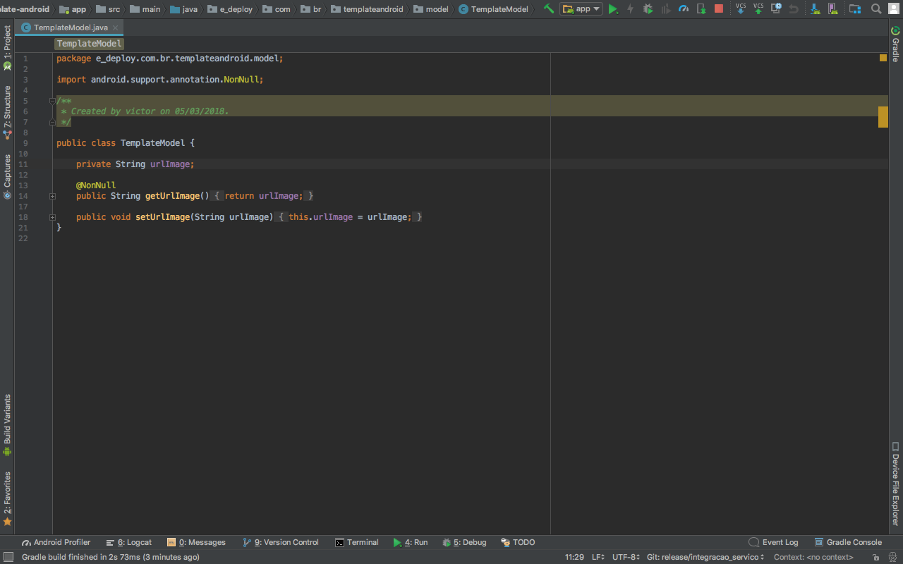

* Mapper - responsável por converter o **ModelResponse do Core** em **Model do App**

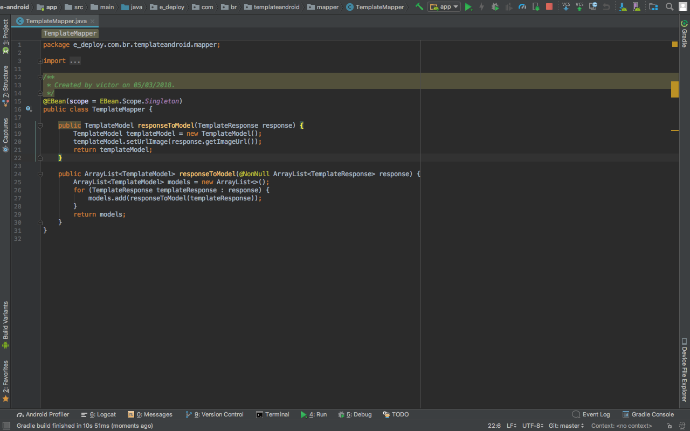

**CORE**

* ModelRequest - Model que representa o conjunto de dados para uma requisição

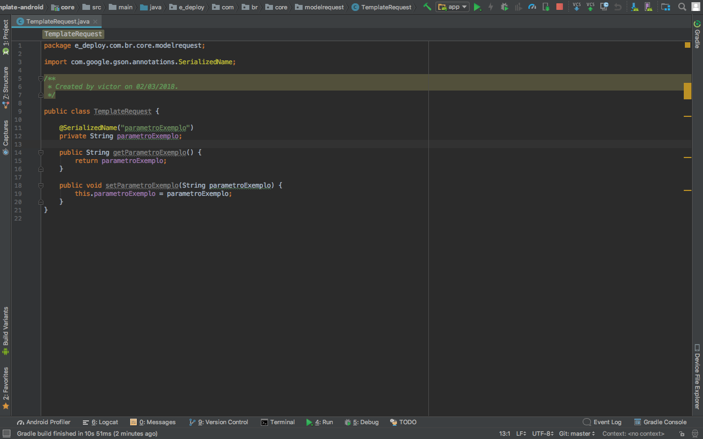

* ModelResponse - Model que representa a resposta de uma requisição

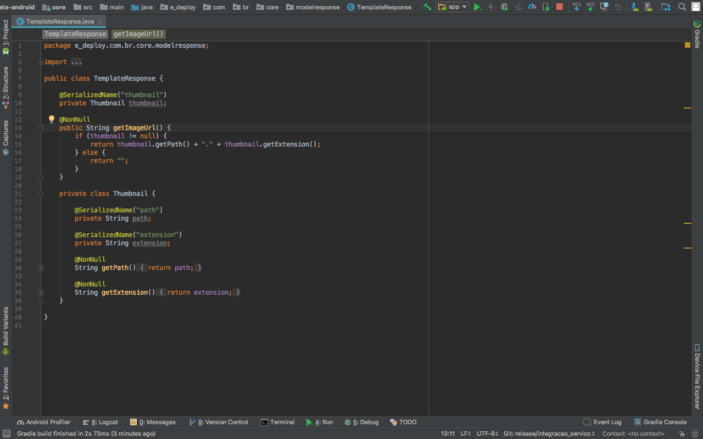

* API - Classe que controla as chamadas 


