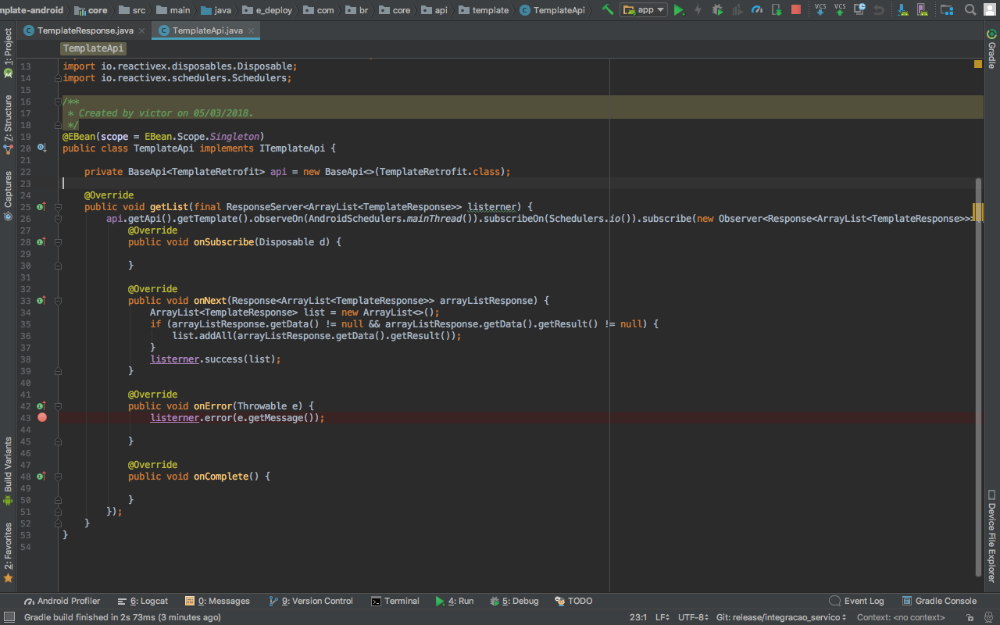

# Duplicar Projeto GIT
**AtravÈs do GIT BASH**

* 1 - Abra o Gitbash
* 2 - Vamos utilizar o comando **bare**, que copia as ramificaÁıes do projeto. Para clonar o projeto utilize o comando **git clone --bare "URL do repositÛrio"**
* 3 - ApÛs termos clonado o projeto, iremos para o caminho que se encontra o projeto utlizando **cd nome_projeto.git**
* 4 - Uma vez que estamos dentro do projeto, podemos espelha-lo para outro repositÛrio utlizando o comando **git push --mirror "URL do novo repositÛrio"**
* 5 - Sem necessidade de existir o velho repositÛrio, podemos remove-lo. Utilizando o comando **cd..** iremos voltar para a pasta root, agora com o comando **rm -rf "Velho-repositÛrio.git"** iremos remover o projeto.

**EXEMPLO**

```
Projeto: https://github.com/vcmoraes/themovies

//CLONANDO O REPOSIT”RIO
git clone --bare https://github.com/vcmoraes/themovies

//ESPELHANDO O PROJETO PARA O NOVO REPOSIT”RIO
cd the-movie.git
git push --mirror https://github.com/novocaminhogit/new-the-movie.git

//REMOVENTO O REPOSIT”RIO ANTIGO
cd ..
rm -rf the-movie.git
```

# Importar Projeto GIT
**AtravÈs do GIT BASH**

* 1 - Abra o Gitbash
* 2 - Selecione o caminho que vocÍ deseja importar o projeto atravÈs de cd Caminho... 
	Exemplo: **cd c**: ENTER
		 **cd Users/Public/Documents** (Caso aperte o TAB, o comando ter· um auto complete para o diretÛrio)
		 Nota: Para ver os diretÛrios presentes em que o usu·rio se encontra digite a palavra dir e aperte ENTER
* 3 - ApÛs selecionado e especificado o caminho copie a URL do diretÛrio onde o projeto GIT est·.
* 4 - Para importar o projeto use o comando **git clone** "URL do diretÛrio"
* 5 - Caso vocÍ tenha permiss„o para acessar o repositÛrio, o projeto ser· copiado para o caminho especificado, caso n„o tenha, ir· abrir uma sess„o de login para entrar com os dados de usu·rio.

**EXEMPLO**

```
Projeto: https://github.com/vcmoraes/themovies

//Navegar atÈ o caminho da pasta
cd Users/Public/Documents
git clone https://github.com/vcmoraes/themovies
```

# Importar Projeto

* 1 - Baixe e instale a vers„o mais recente do Android Studio: [ANDROID STUDIO](https://developer.android.com/studio/index.html?hl=pt-br)
* 2 - Inicie o Android Studio e em seguida selecione a opÁ„o **"Open an existing Android Studio project"**


* 3 - Navegue atÈ a pasta no qual foi feito a importaÁ„o e selecione a pasta **"template-android"** e ent„o realize a importaÁ„o


# Entendendo o Projeto

Esse projeto utiliza o conceito MVP (Model View Presenter) com **UseCases**, ou seja, temos a camada da **View** que se comunica com o **Presenter** no qual se comunica com os **UseCases** e os mesmo se comunicam com os ServiÁos(**core**).


**APP**

* Tela - **View** respons·vel por mostrar informaÁıes ao usu·rio, como **Activity, Fragment, Dialog e etc**. 


* Contract - **Interface** respons·vel por garantir o **contrato entre o Presenter e a View**.


* Presenter - respons·vel por fazer a comunicaÁ„o entre a **View** e os **UseCase**, **(NO PRESENTER N√O VAI REGRA DE NEG”CIO, POIS SE N√O O USECASE FICA SEM EMPREGO)**


* UseCase - respons·vel por fazer a comunicaÁ„o entre **Presenter** e o ServiÁo(**core**), sendo aqui onde fica as regras de negÛcios e convers„o dos objetos entre **App e Core** utilizando os **Mapper**, **(NADA DE FAZER CONVERS√O FORA DOS MAPPERS, POIS ELES PRECISAM DESSE EMPREGO)**


* Model - respons·vel por representar os dados de um Objeto para as **View**


* Mapper - respons·vel por converter o **ModelResponse do Core** em **Model do App**


**CORE**

* ModelRequest - Model que representa o conjunto de dados para uma requisiÁ„o


* ModelResponse - Model que representa a resposta de uma requisiÁ„o


* API - Classe que controla as chamadas 

